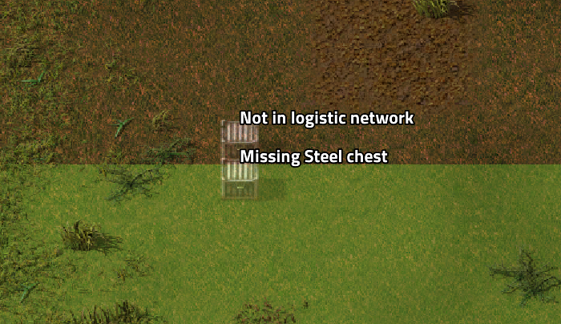
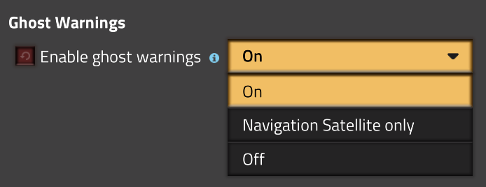

# Ghost Warnings

**Ghost Warnings** is a utility mod that cross-checks your blueprints against your available logistics networks, warning you immediately if you are missing the items or modules needed to build them.

---

## Features

* **Multi-Network Inventory Scanning:** Reads available items from any number of overlapping logistics networks as well as your player networks (via personal roboports).
* **Blueprint Missing Item Alerts:** Warns you when placing blueprints if certain buildings in the layout are currently missing from your inventory or logistics supply.
* **Module Support:** Warns about missing modules when placing blueprints with pre-configured modules, or when using mods like *Module Inserter*, *Module Inserter Simplified*, and similar tools.
* **Smart Notification Throttling:** Subsequent identical warnings from the same held-click action are hidden. An additional alert cooldown length can be customized directly in the mod settings.

---

## Previews

---

## Credits

* **Author:** Developed by [Xorimuth](https://mods.factorio.com/user/Xorimuth).
* **Mod Portal:** Find it on the [Factorio Mod Portal](https://mods.factorio.com/mod/GhostWarnings).
* **Audio:** Warning sound sourced from [Mixkit Alarm Sounds](https://mixkit.co/free-sound-effects/alarm/) with minor edits by `xor50`.